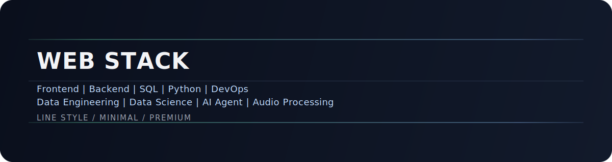

  

<h1 align="center">Website Packaging Layer</h1>

  <strong>Simple, line-based, and premium presentation for a modern web stack.</strong>

  
  
  
  
  
  
  
  
  

## Overview
This homepage is built as a clean front layer for project presentation.
It focuses on structure, readability, and visual consistency without personal profile content.

## Design Direction
- Line-based visual language
- Minimal composition with controlled contrast
- Modern and professional tone
- High readability on desktop and mobile

## Stack Line
Frontend | Backend | SQL | Python | DevOps | Data Engineering | Data Science | AI Agent | Audio Processing

## What This Homepage Highlights
- Product-first messaging
- Clean section rhythm and spacing
- Premium style with low visual noise
- Easy extension for demos and docs

## Current Status
Packaging is active and continuously refined.

## Next Packaging Steps
- Add a screenshot strip in a single-line gallery
- Add live demo links when available
- Keep documentation style consistent across repositories

---

  Built for clarity, usability, and continuous improvement.

